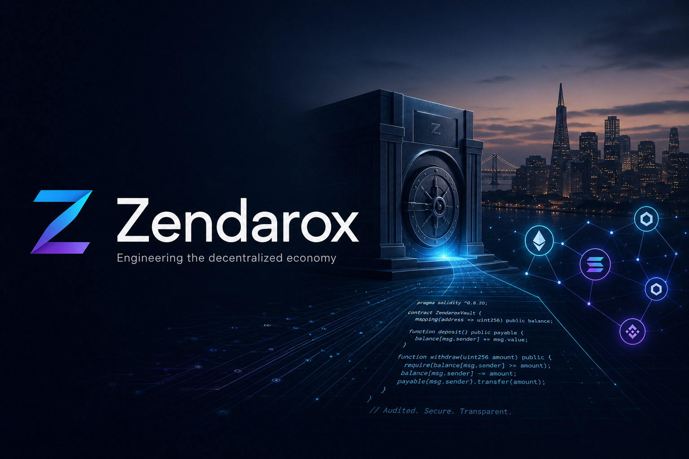

<!-- Zendarox GitHub Organization Profile README -->
<!-- Deploy: push to github.com/zendarox/.github (profile/README.md + assets/) -->
<!-- Images use relative paths — works once assets/ is in the same repo -->

  

<h1 align="center">Zendarox</h1>

<strong>Engineering the decentralized economy</strong>

<em>Production DeFi engineering studio · San Francisco</em>

  
  
  

  
  
  
  
  

---

## About

**Zendarox** is a DeFi engineering studio founded in San Francisco in April 2025. We build production-grade protocols for clients — and develop **Zendarox Vault**, our flagship lending product, in parallel.

We scope work to real requirements: smart contract architecture, Solidity development, security audits, cross-chain integrations, tokenomics, and launch operations for lending protocols, AMMs, yield vaults, and institutional treasury systems.

> We ship what your requirements doc asks for — not a template fork.

---

## Capabilities

| Practice | What we deliver |
|----------|-----------------|
| **DeFi Protocol Studio** | Lending markets, AMMs, ERC-4626 vaults — architecture through deployment playbooks |
| **Smart Contract Security** | Manual audits, Foundry fuzzing, invariant suites, remediation re-review |
| **Cross-Chain & Messaging** | Treasury modules, rate limits, pause hooks, relayer monitoring |
| **Tokenomics & Governance** | Emission schedules, ve-token modeling, mercenary LP stress scenarios |
| **Institutional Design** | Permissioned vaults, KYC-gated deposits, compliance reporting APIs |

**Typical timelines:** 2–4 weeks (audits) · 12–18 weeks (protocol builds) · 14–20 weeks (cross-chain)

---

## Flagship Product

<table>
<tr>
<td width="120"><strong>Vault</strong></td>
<td>

**Zendarox Vault** — isolated lending markets with a yield router.

- Architecture locked Q1 2026
- Contract v0.4 in internal QA
- August audit sprint booked · Q4 2026 mainnet target

</td>
</tr>
</table>

---

## Stack

  
  
  
  
  
  

**Networks:** Ethereum · Base · Arbitrum

**Security tooling:** Slither · Echidna · Certora · Tenderly

---

## Selected Client Work

| Engagement | Category | Network |
|------------|----------|---------|
| NovaDEX — AMM Hook Security Audit | Audit | Base |
| Cascade Lending — Security Audit | Audit | Arbitrum |
| Keystone Capital — Permissioned Vault | Institutional | Ethereum |
| Frame Treasury — Stablecoin Ops | Treasury | Base |
| Relay Labs — Cross-Chain Treasury | Cross-chain | Arbitrum ↔ Base |
| Parallel Flow — Liquid Staking Router | Vault build | Ethereum |

[View all work →](https://zendarox.com/work)

---

## Open Source & Research

Public repositories on this organization include protocol research, audit tooling, and reference implementations from client delivery engagements. Private repos hold production client code under NDA.

| Repo focus | Description |
|------------|-------------|
| **Protocol R&D** | Zendarox Vault contracts, economic simulations, ADRs |
| **Security** | Invariant harnesses, fuzz fixtures, audit report templates |
| **Client deliverables** | Runnable Node.js consoles and ops dashboards (where permitted) |

---

## Work With Us

  
  

---

  
    <strong>Zendarox DeFi Studio</strong> · San Francisco, CA · <a href="https://zendarox.com">zendarox.com</a>
     
    Production DeFi engineering since April 2025
  

